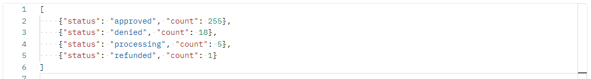
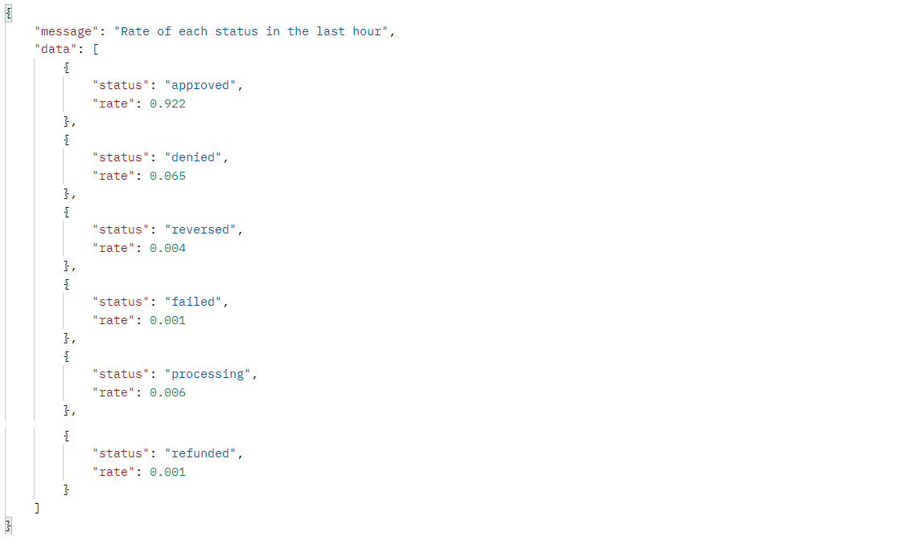

<h1 align="center">Monitoring Solution</h1>

## ℹ️About the project
In this project, I proposed 2 different approaches to monitor an application.

### In the first approach, there are 2 endpoints:
- POST endpoint that receives data every minute with information about the number of transactions in the previous minute and inserts it in the database. The possible transaction types are: approved, denied, reversed, failed, processing, backend_reversed and refunded. Below is an example of the body of the request (all of the information is optional):

- GET endpoint that is requested every hour and gets information from the database about the last hour. Below is an example of the response of the http request:

With this information, the endpoint calculates the z-score of each average rates and based on this information it sends an alert to the team when the failed transaction rates, the denied transaction rates and/or the reversed transaction rates are above normal.

### In the second approach, there are also 2 endpoints:
- POST endpoint (the same as the first approach)
- GET endpoint that also requests information from the database and receives the same response as the endpoint in the first approach. The difference here is that instead of calculating z-scores, I used a decision tree to predict the expected rates of each transaction status for that specific hour.
- Based on the predicitons, the endpoint sends and alert to the team when the failed transaction rates, the denied transaction rates and/or the reversed transaction rates are above normal.

## 💻Technologies used:
- Python
- Flask
- Flask Mail
- MySQL
- Grafana

## 🛰Running the project
<pre>
  <code>git clone https://github.com/francinehahn/monitoring-solution.git</code>
</pre>

<pre>
  <code>cd monitoring-solution</code>
</pre>

<pre>
  <code>pip install -r requirements.txt</code>
</pre>

Create a file .env and complete the following variables:
<pre>
  <code>
    host = ""
    user = ""
    password = ""
    database = ""

    MAIL_SERVER = ""
    MAIL_USERNAME = ""
    MAIL_PASSWORD = ""
  </code>
</pre>

